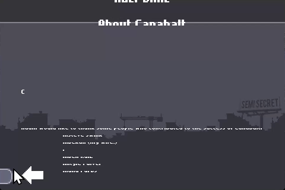

# canabaltrecomp

> *Canabalt* (Semi Secret Software, 2009) as a native desktop application,
> lifted from the original armv6 iPhone binary. Bring your own `.ipa`.



*The recompiled binary, captured by itself: the title arrives, a tap lands on
ABOUT, and the credits scroll in. No window, no cursor, and the same frames
every time -- `ARC_TAP` scripts the taps and `ARC_SHOT_EVERY` writes the
frames, because a run that draws should be able to record itself.*

**Status: the menu is on screen and it responds.** All 626 functions of the
armv6 binary become C and the result compiles; every lifted instruction and
whole function tested agrees with an emulator. The image loads at its own link
address, the Objective-C class table is realized, and `objc_msgSend` dispatches
into lifted code. From there the game runs its whole launch, opens a window,
drives its own `CADisplayLink` frame loop, rasterises its text through
FreeType, uploads its textures, and draws the menu -- and a tap on a button
runs that button's action. Tapping PLAY builds `PlayState` and faults there,
which is where the work is. See [Milestones](#milestones).

---

## What this is

A port, not an emulator: replace the iPhone OS host, satisfy the framework
import surface, and lift the ARM machine code to C. Built on
[iparecomp](https://github.com/sp00nznet/iparecomp), vendored here as a
submodule: the toolkit is deliberately app-agnostic, so everything reusable
lives there and only what is specific to this title lives here.

## Why this game

Canabalt is not here because it needs rescuing. It is here because it is the
best possible **calibration target for a 32-bit ARM emitter**, and the emitter
is the hard part of the whole iparecomp effort.

**It is 100% ARM.** 1,074 defined symbols, zero of them Thumb:

```
symbols    1074 defined, 205 undefined
           1074 ARM, 0 Thumb (0% Thumb)
           single instruction set -- no interworking to lift
```

ARM/Thumb interworking is the single largest source of new work in 32-bit
lifting, and this binary has none of it. The emitter can be brought up, made
correct, and validated end to end before interworking is ever written.

**It is small enough to lift completely.** 626 functions over 0.19 MB of
`__text`, 37,185 instructions. That fits in a differential test run that
finishes in minutes, not overnight.

**It is decrypted.** `LC_ENCRYPTION_INFO` with `cryptid=0`. Most App Store
binaries of the era are not, and an encrypted `__TEXT` ends a project before it
starts.

**And it has ground truth.** Semi Secret released
[the full source](https://github.com/ericjohnson/canabalt-ios), including the
MIT-licensed `flixel-ios` engine. For a game being *ported* that would be
disqualifying — public source needs no recompiling. For an emitter being
*brought up* it is the whole point: when a lifted function computes the wrong
value, what it was supposed to compute can be read rather than bisected out of
an emulator trace.

That is the trade. This repo produces a calibration weight, not a product.
Angry Birds — decrypted armv6, 3,633 functions, 21% Thumb, no source anywhere,
unplayable on any shipping device since iOS 11 — is the first port chosen for
its own sake, once the emitter earns it.

## The engine is flixel-ios

`objc_dump.py` reads the class table straight out of `__DATA` — the ObjC 2.0
ABI writes it in a documented layout, so this is read, not reverse-engineered.
49 classes, 518 methods, 506 distinct selectors, and the names say everything:

```
  FlxGame           21 methods      FlxSprite         60 methods
  FlxGlobal         60 methods      FlxCore           42 methods
  FlxGLView         14 methods      FlxEmitter        23 methods
  FlxState           5 methods      FlxText           19 methods
```

Flixel, in Objective-C. The host boundary is three classes and it is small:

| class | what the host owes it |
|---|---|
| `CanabaltAppDelegate` | `applicationDidFinishLaunching:`, `applicationWillTerminate`, active/resign — the lifecycle a desktop host synthesises |
| `FlxGLView` | `initWithFrame:`, `createFramebuffer`, `touchesBegan/Moved/Ended/Cancelled:withEvent:` — the GL surface and all input |
| `FlxViewController` | `loadView`, orientation |

Everything else in the app is reached through `objc_msgSend` and needs no host
code at all. `contract/canabalt-classes.txt` is the full extracted table.

## The shim surface

205 undefined symbols, grouped by the framework that owes each one — exact, not
guessed, because every Mach-O import names its own dylib:

| framework | n | | framework | n |
|---|---|---|---|---|
| OpenGLES | 39 | | libSystem.B.dylib | 10 |
| CoreGraphics | 38 | | libobjc.A.dylib | 9 |
| UIKit | 27 | | AudioToolbox | 8 |
| Foundation | 20 | | CoreData | 8 |
| OpenAL | 14 | | libgcc_s.1.dylib | 3 |
| CoreFoundation | 14 | | QuartzCore | 2 |
| Security | 12 | | AVFoundation | 1 |

OpenGLES is mostly free — desktop GL exports GLES 1.1 entry points under
identical names. UIKit becomes SDL2. Security and CoreData are stubbable; this
is a game that keeps a high score. The genuinely new work is CoreGraphics, the
ObjC runtime, and audio.

All of it lives in iparecomp, not here, and the second port inherits it.

## Legal / content policy

Tools only. No game code, no game assets, no extracted art, no save data, no
publisher binaries — `.gitignore` blocks all of it, deliberately. You supply
your own legally obtained `.ipa`; everything here operates on a file you
already have. Licensed MIT; contributions must be your own work.

Note that the game's own source is separately available from its authors under
their terms; this repo neither vendors nor redistributes it.

## Building

```sh
git clone --recursive https://github.com/sp00nznet/canabaltrecomp
cmake -S . -B build -DCMAKE_BUILD_TYPE=Release
cmake --build build

./build/canabalt_host path/to/Payload/Canabalt.app/Canabalt
```

On Windows add `-DCMAKE_TOOLCHAIN_FILE=C:/vcpkg/scripts/buildsystems/vcpkg.cmake`
so CMake finds zlib and SDL2. A toolchain file only takes effect on a fresh
cache, so delete `build/` if you add it later.

Re-derive the contract and the triage yourself:

```sh
python iparecomp/tools/objc_dump.py <binary> --contract > contract/canabalt-classes.txt
python iparecomp/tools/ipa_probe.py Canabalt.ipa --out docs/triage-canabalt-armv6.md
```

Lift the game. The output is machine code derived from a binary you supplied,
so it is built locally and never committed — `.gitignore` keeps `generated/`
out, and CMake picks it up automatically once it exists:

```sh
python iparecomp/tools/lifter.py Canabalt.ipa --report      # 626/626 functions
python iparecomp/tools/lifter.py Canabalt.ipa --out generated/
python iparecomp/tools/lift_verify.py Canabalt.ipa          # against Unicorn
cmake --build build
```

## This repo is the thin half

```
canabaltrecomp/
├── iparecomp/                      # submodule -- loader, shims, emitter, tools
├── contract/canabalt-classes.txt   # the extracted ObjC class table
├── docs/triage-canabalt-armv6.md
├── generated/                      # the lifted game -- built locally, never committed
└── CMakeLists.txt
```

At the moment that is one generated text file and a triage report — which is
exactly the point. Nothing reusable belongs here; nothing title-specific
belongs in the toolkit.

## Milestones

- [x] **M0 — triage.** armv6, decrypted, 626 functions, 80.1% `__text`
      coverage, 37,185 instructions, 0% Thumb.
- [x] **M1 — contract.** 49 classes and 518 methods extracted; the host
      boundary narrowed to three of them.
- [x] **M2 — the binary loads.** Segments mapped, slide recorded, 205 imports
      resolved to their owing frameworks.
- [x] ~~**M3 — decoder.**~~ **Dropped.** Capstone already decodes armv6, so
      this milestone was to write a worse one and then check it against the
      real one. The lifter emits from capstone's operand detail directly.
- [x] **M4 — emitter.** 626 of 626 functions, 41,167 of 41,167 instructions,
      compiling clean. No interworking, no Thumb, no IT blocks — the reason
      this game is first.
- [x] **M5 — differential test.** 62,421 per-instruction cases over 159
      operand forms, and 4,726 whole-function cases over **594 of the game's
      626 functions** -- including every one that calls another, by
      neutralising the imports identically on both sides. All at 100%
      agreement with Unicorn. Next: against what the published source says
      they should compute.
- [x] **M5.5 — the game loads where it has to.** The binary carries no
      relocations, so it can only go at its link address -- which is under the
      64 KB floor. The lifter folds all 5,852 literal-pool loads into
      constants, which leaves nothing reading `__text`, so the image maps from
      `0x10000` up with a zero slide.
- [x] **M6 — ObjC runtime.** All 49 classes and their metaclasses realized,
      categories merged, and `objc_msgSend` answering from the class table.
      88/88 test messages reach the right implementation, and the realized
      table agrees with `objc_dump.py` on every class and method. The game's
      own 314 selectors are answered by its own lifted code.
- [ ] **M7 — shims.** 113 of the 147 reachable imports answered. The game
      loads its own textures from the bundle's 73 PNGs, its own font from
      `Nokia.ttf` through FreeType, and runs from `_start` through audio, the
      GL framebuffer, sprite construction, the high-score store and the menu's
      buttons, printing its own `NSLog` output as it goes.

      It stops in text layout, on a wild pointer in `-[SSText setText:]`. That
      is now a reported fault rather than a bare crash:

      ```
      the guest faulted: reading 0000000080200593
        0000000080200593 is free

      guest functions entered, most recent first:
        0x00021300  -[SSText setText:]
        0x00021fac  -[SSText(Private) computeNewBounds]
      ```

      Two ABI findings came out of this path and neither has a size rule behind
      it: `NSRange` and `CGPoint` both come back through `objc_msgSend_stret`,
      where the hidden return pointer takes r0 and the receiver moves to r1.
      Reading one as an ordinary send is what had the word-wrap loop searching
      a string that was not there.

- [ ] **M8 — a window, and a man running to the right.**
